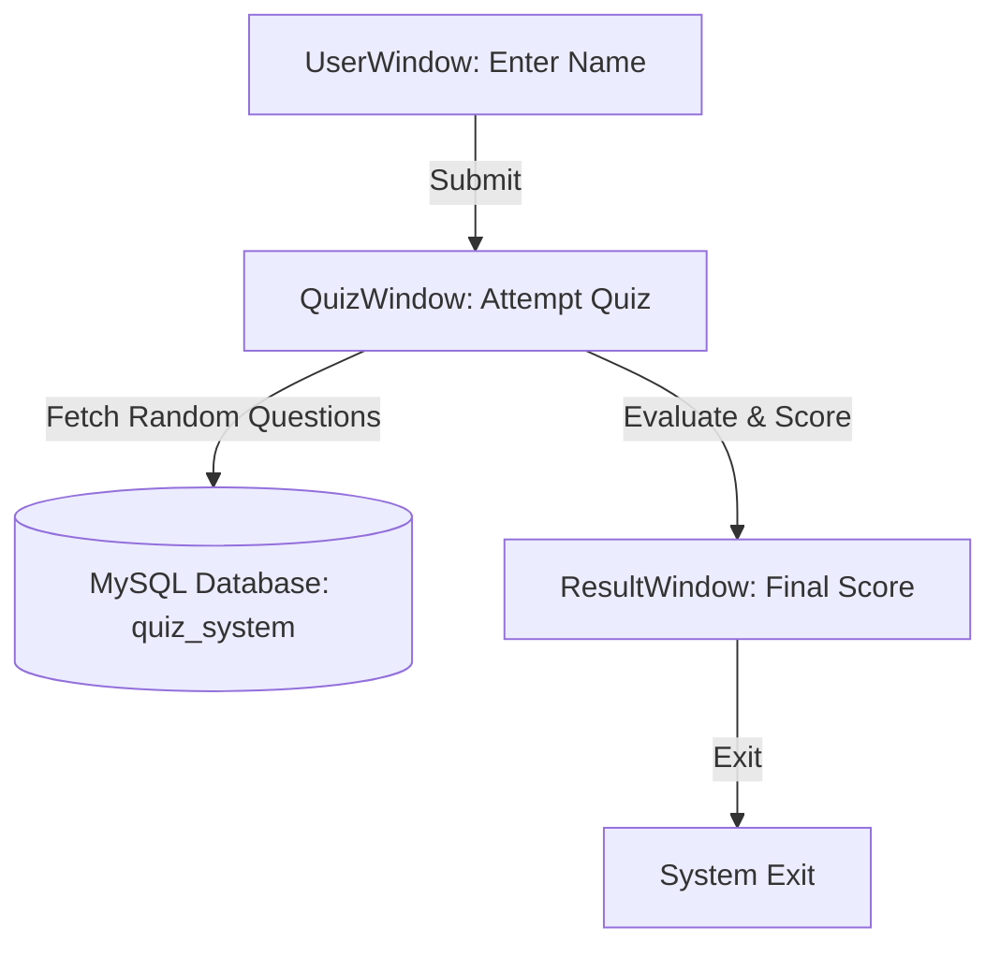
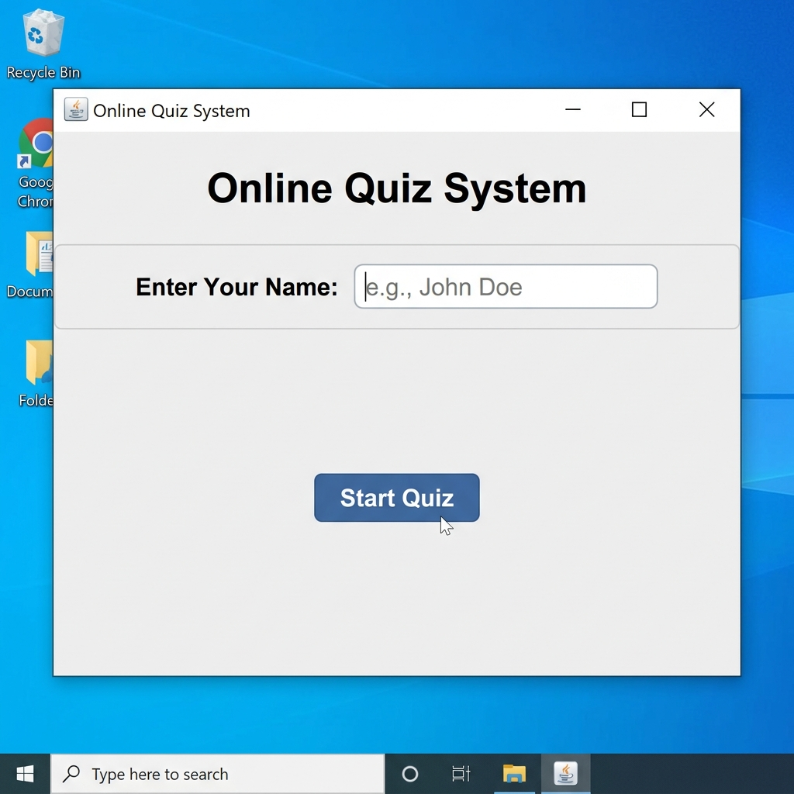
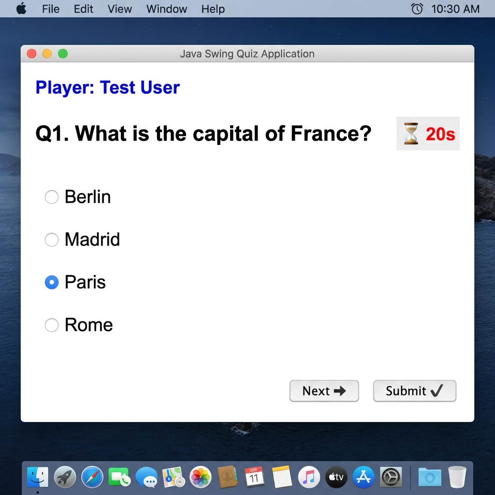
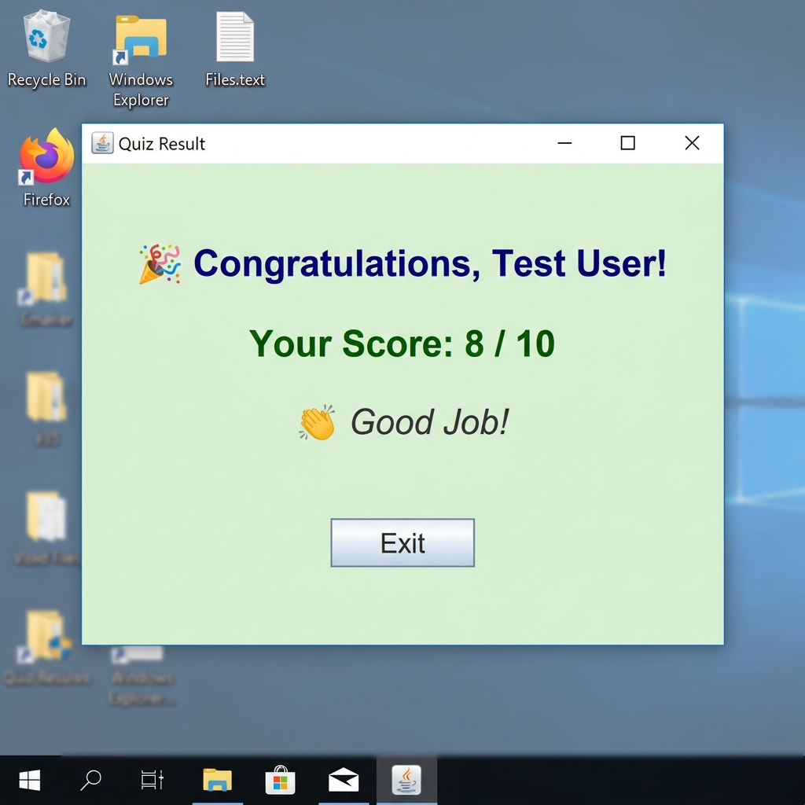

# 🎯 Interactive Quiz Management System

A high-performance, GUI-based **Quiz Management System** built with **Java Swing** and integrated with a **MySQL Database** via JDBC. This project transitions traditional terminal-based quiz applications into a modern desktop experience, loading questions dynamically and grading them in real-time.

---

## 📖 Table of Contents
1. [Project Overview](#-project-overview)
2. [Key Features](#-key-features)
3. [System Architecture](#-system-architecture)
4. [Database Configuration](#-database-configuration)
5. [Getting Started](#-getting-started)
6. [Screenshots](#-screenshots)
7. [Technologies Used](#-technologies-used)
8. [Folder Structure](#-folder-structure)
9. [Future Enhancements](#-future-enhancements)

---

## 🪄 Project Overview

The **Interactive Quiz Management System** provides a user-friendly GUI environment for conducting quizzes. Instead of hardcoding questions into the source code, this application dynamically fetches questions and options from a MySQL database. This makes the system:
* **Highly Scalable:** Add, remove, or modify quiz questions without recompiling or altering the Java source files.
* **Randomized Selection:** Questions are randomly selected and capped (e.g., 10 questions per session) to ensure a unique quiz experience every run.
* **Performance-Oriented:** Leverages optimized JDBC connections to retrieve database records instantaneously.

For a detailed overview of the initial design requirements and layout specifications, refer to the [Java project Synopsis.pdf](Java%20project%20Synopsis.pdf).

---

## ✨ Key Features

* 👤 **User Onboarding Window:** A simple authentication/identification screen requesting the player's name before starting.
* 🧠 **Dynamic Question Engine:** Fetches quiz datasets dynamically from the database.
* ⏳ **Real-Time Timer:** Each question includes a 20-second countdown timer. If the time expires, the application automatically evaluates the response and transitions to the next question.
* 🎛️ **Intuitive GUI Navigation:** Clean layouts containing structured navigation buttons (`Next ➜` and `Submit ✅`).
* 📊 **Instant Evaluation & Results:** Displays the final score immediately upon quiz completion, accompanied by a context-sensitive performance message.
* 🔒 **Automatic Resource Management:** Safely establishes and disposes of JDBC connection resources.

---

## ⛓️‍💥 System Architecture



---

## 🎛️ Technologies Used

| Technology | Purpose | Description |
| :--- | :--- | :--- |
| **Java SE (8+)** | Core Application | Language used to program all application logic. |
| **Java Swing & AWT** | GUI Design | Framework for creating windows, labels, buttons, and layouts. |
| **JDBC API** | Database Connectivity | Connects the Java application to the relational database. |
| **MySQL Server** | Relational Database | Stores quiz questions, multiple-choice options, and correct answers. |

---

## 🗄️ Database Configuration

The application expects a MySQL database named `quiz_system` to be configured. The SQL schema is provided in [quiz_system.sql](quiz_system.sql).

### Table Schema (`questions`):
```sql
CREATE TABLE questions (
    id INT AUTO_INCREMENT PRIMARY KEY,
    question_text VARCHAR(255) NOT NULL,
    option1 VARCHAR(255) NOT NULL,
    option2 VARCHAR(255) NOT NULL,
    option3 VARCHAR(255) NOT NULL,
    option4 VARCHAR(255) NOT NULL,
    correct_option INT NOT NULL
);
```

---

## 💻 Getting Started

### Prerequisites:
* **Java Development Kit (JDK 8 or above)** installed and configured on your system PATH.
* **MySQL Server** running locally on port `3306`.

### Step 1: Import the Database Schema
Open your MySQL terminal or client (e.g., MySQL Workbench, phpMyAdmin) and execute the SQL file:
```bash
mysql -u root -p < quiz_system.sql
```
*(This creates the database, initializes the table, and inserts 25 sample questions).*

### Step 2: Configure Database Credentials
Open `QuizSystem.java` and modify the connection details inside the `Database` class constructor if your local credentials differ:
```java
String url = "jdbc:mysql://localhost:3306/quiz_system";
String username = "root";
String password = "your_password_here";
```

### Step 3: Compile and Run the Project
Compile the application using the included classpath connector ZIP:
```bash
javac -cp ".;mysql-connector-j-9.4.0.jar.zip" QuizSystem.java
```
Run the application:
```bash
java -cp ".;mysql-connector-j-9.4.0.jar.zip" QuizSystem
```

---

## 🖼️ Screenshots

The following are the actual GUI screens captured from the running application:

### 1. Front Onboarding Window (Name Input)


### 2. Live Quiz Window (Active Questions and Timer)


### 3. Quiz Result Scoreboard


---

## 📁 Folder Structure
```text
QuizSystem/
├── screenshots/                     # Application GUI screenshots
│   ├── front_auth.png
│   ├── quiz_window.png
│   └── final_score.png
├── Java project Synopsis.pdf        # Project proposal and synopsis documentation
├── mysql-connector-j-9.4.0.jar.zip  # MySQL JDBC Connector driver
├── questions.ibd                    # MySQL table tablespace database file
├── quiz_system.sql                  # MySQL database initialization script
├── QuizSystem.java                  # Main application source code
└── README.md                        # Project documentation
```

---

## 🚀 Future Enhancements

* 🔐 **Secure Login System:** Authenticated accounts with registration features.
* 👨‍💼 **Admin Dashboard:** GUI panel for managers to add, update, or remove database questions seamlessly.
* 🏆 **Leaderboards:** Record high scores in a database table to display historical top performers.
* 📈 **Analytics Charts:** Visual representation of user performance using GUI-based chart packages.
